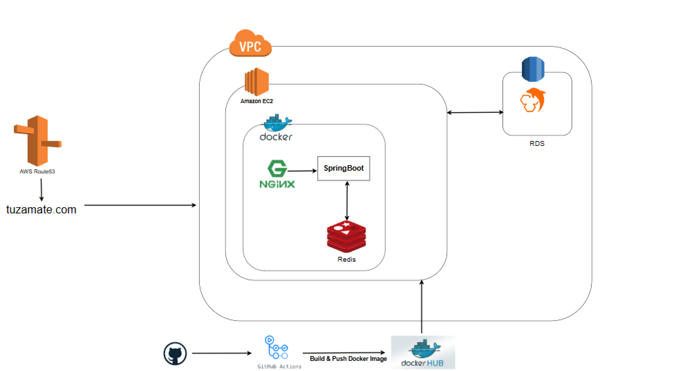
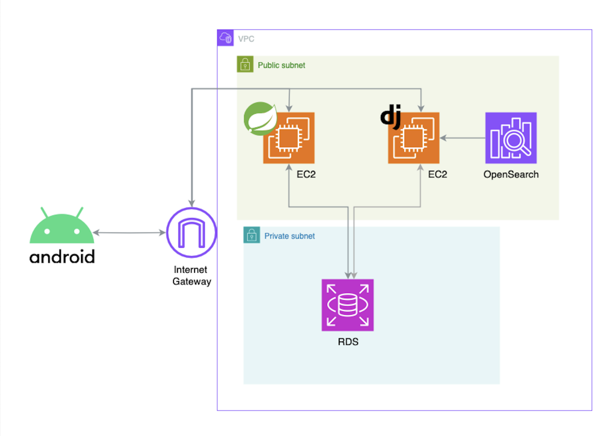
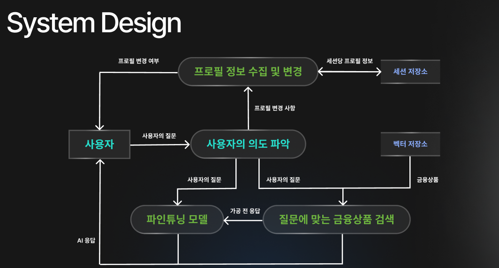

# TUZAMATE - 금융상담 챗봇 서비스

## 아이디어 소개
"투자메이트"는 사용자에게 맞춤형 금융 상담을 제공하는 챗봇 서비스입니다. 
이 서비스는 인공지능 기술을 활용하여 사용자의 재정 상황, 투자 목표, 위험 성향 등을 분석하고, 이에 기반한 개인화된 투자 조언과 금융 상품 추천을 제공합니다.

## 주요 기능
1. **맞춤형 금융 상담**: 사용자의 재정 상태와 목표에 맞춘 투자 전략 및 금융 상품 추천.
2. **시장 분석**: 시장 동향을 반영한 투자 조언 제공.
3. **커뮤니티**: 사용자 간 경험 공유를 위한 플랫폼 제공.
4. **뉴스 카드**: 최신 금융 뉴스와 트렌드를 카드 형식으로 제공하여 사용자가 쉽게 정보를 습득할 수 있도록 지원.

## 기술 스택 (백엔드 스프링 파트)
Java17, Spring Boot, MySQL, AWS EC2, Nginx, Docker, Redis, JPA, Spring Security, Spring Data JPA, FCM

## 외부 연동
- 금융감독원 오픈 API : 금융 상품 정보 제공
- 카카오톡 로그인 API : 사용자 인증
- 한국투자증권 오픈 API : 주식 시세 제공

## 아키텍처 구조
### 스프링 백엔드 아키텍처

### 전체 아키텍처

## 전체 시스템 흐름도

## 다른 파트 github 링크
- 안드로이드 : https://github.com/NaughtyComputer/Naughty-FE-Android-v2
- 장고(AI) : https://github.com/NaughtyComputer/Naughty-BE-Django